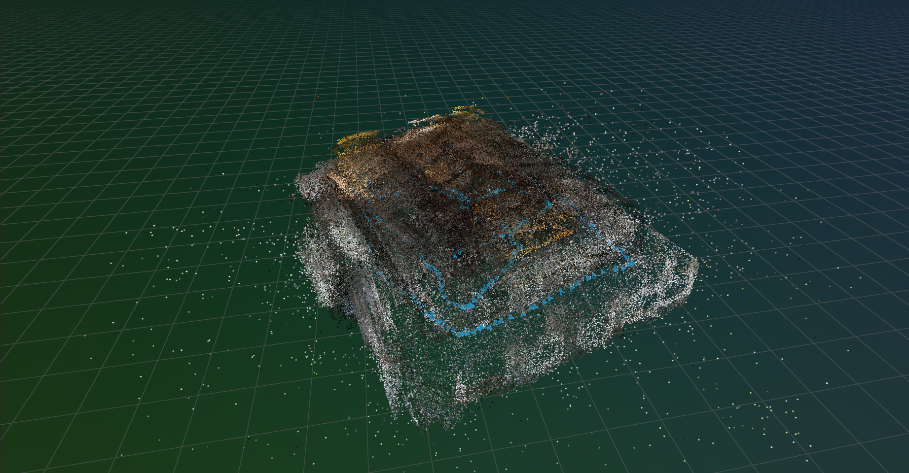

# SceneForge: Hierarchical Neural SfM with GPU Bundle Adjustment

<p align="center">
  <a href="https://vggt-omega.github.io/">
    
  </a>
  <a href="https://nvidia-isaac.github.io/cuNLS/">
    
  </a>
  <a href="https://rerun.io/" target="_blank">
    
  </a>
</p>

<div align="justify">

SceneForge is a hierarchical neural structure-from-motion pipeline for continuous
monocular video. It combines learned keyframe selection and VGGT-Ω geometry priors
with **SIM(3)** alignment to assemble overlapping reconstructions into a common map.
SelaVPR++ retrieves loop candidates whose verified feature correspondences
constrain GPU-accelerated cuNLS bundle adjustment of camera poses, shared
intrinsics, and sparse landmarks. Multi-view depth refinement and fusion produce a colored dense
point cloud, with live Rerun visualization throughout the pipeline.

</div>

https://github.com/user-attachments/assets/e11bb4bb-bc97-4042-ab52-a19de2ddf6a7

## 🖥️ Tested Configuration

SceneForge has been tested on:

- 🐧 **Ubuntu:** 24.04
- 🧠 **GPUs:** 2 × NVIDIA RTX A6000, with 48 GB VRAM per GPU
- ⚙️ **CUDA (host):** 13.3
- 🧊 **Environment:** Docker with NVIDIA Container Toolkit and GPU support

> This is the tested reference configuration. Memory requirements depend on image
> resolution and the number of keyframes per VGGT-Ω window.

## 🎬 Sample Videos

Some of the videos used with SceneForge, from
[Tanks and Temples](https://www.tanksandtemples.org/download/):

- [**Barn**](https://drive.google.com/file/d/0B-ePgl6HF260ZlBZcHFrTHFLdGM/view?usp=sharing&resourcekey=0-e64ZPu9sUpdNaPTNnjCpXw)
- [**Caterpillar**](https://drive.google.com/file/d/0B-ePgl6HF260Z00xVWgyN2c3WEU/view?usp=sharing&resourcekey=0--zNcCkfMys94g7ZoRRyaGg)
- [**Meeting Room**](https://drive.google.com/file/d/0B-ePgl6HF260V3BFSFFTZFJwSWc/view?usp=sharing&resourcekey=0-BZ5VQktqutuIpQSvImnUvg)

The dataset has its own [license terms](https://www.tanksandtemples.org/license/).

## 🚀 Quick Start

Install Git, Docker with NVIDIA Container Toolkit, and FFmpeg (`ffprobe`) on the
host before starting. Run these commands from the host terminal.

1. **Clone the repository and its submodules**

   ```bash
   git clone --recurse-submodules https://github.com/jagennath-hari/SceneForge.git
   cd SceneForge
   ```

2. **Set up Hugging Face access**

   Request access to [VGGT-Ω](https://huggingface.co/facebook/VGGT-Omega) and wait
   for approval. Create the token file:

   ```bash
   mkdir -p .secrets
   chmod 700 .secrets
   (umask 077; touch .secrets/hf_token)
   chmod 600 .secrets/hf_token
   nano .secrets/hf_token
   ```

   Paste only a read token from the approved account with access to the VGGT-Ω
   repository, then save the file. It is ignored by Git and mounted read-only.
   Model weights download automatically when needed.

3. **Reconstruct a video**

   For example, save the [Barn video](https://drive.google.com/file/d/0B-ePgl6HF260ZlBZcHFrTHFLdGM/view?usp=sharing&resourcekey=0-e64ZPu9sUpdNaPTNnjCpXw) as `data/input/barn.mp4`, then run:

   ```bash
   bash scripts/build_and_start.sh "data/input/barn.mp4"
   ```

   Builds the Docker environment and runs reconstruction with live Rerun
   visualization. Results are saved under [data/output/](data/output/).

   The viewer stays open after reconstruction; close it to exit. To run headless
   and save a recording without opening a window:

   ```bash
   bash scripts/build_and_start.sh "data/input/barn.mp4" --headless
   ```

   Reopen the saved recording later (use the path printed at the end of the run):

   ```bash
   bash scripts/visualize.sh "data/output/<run>/<map>/pipeline.rrd"
   ```

> Use a continuous video without cuts. Replace the example path with any local
> video file; it does not need to be inside the repository. Quote paths containing spaces.

https://github.com/user-attachments/assets/7ea90940-dd29-47ac-b4bf-821049f6747f

## 🏗️ System Architecture

```mermaid
flowchart TD
    video["Continuous monocular video"]

    subgraph frontend["1 · Keyframes and image correspondences"]
        keyframes["Streaming decode + keyframe selection<br/>FFmpeg / NVDEC · RaCo–ALIKED / LightGlue+ · CUDA RANSAC"]
        prepare["Joint feature-image preparation<br/>Local feature images + SelaVPR++ global descriptors"]
        temporal["Temporal neighbor pairs"]
        loops["Distant loop candidates<br/>Global descriptor retrieval"]
        matching["Unified pair verification<br/>RaCo–ALIKED / LightGlue+ + RANSAC"]
        tracks["Measured feature tracks<br/>Verified temporal and loop correspondences"]
        repair["Bounded connection repair<br/>Insert intermediate frames from the source video"]

        keyframes --> prepare
        prepare --> temporal
        prepare --> loops
        temporal --> matching
        loops --> matching
        matching --> tracks
        tracks -->|Weak temporal connections| repair
        repair -->|Additional frames| prepare
    end

    subgraph mapping["2 · Geometry and common map"]
        windows["Overlapping VGGT-Ω windows<br/>Depth · confidence · intrinsics · camera poses"]
        local["Local cuNLS bundle adjustment<br/>Initialize landmarks from depth and measured tracks"]
        common["Common map assembly<br/>Graph-ordered Sim(3) alignment + map refinement"]
        globalBA["Final global cuNLS bundle adjustment<br/>Shared intrinsics · camera poses · sparse landmarks"]

        windows --> local
        local --> common
        common --> globalBA
    end

    subgraph reconstruction["3 · Dense refinement and output"]
        depth["Depth calibration and multi-view refinement<br/>VGGT-Ω depth + optimized sparse geometry"]
        fusion["Colored dense point-cloud fusion"]
        output["Saved reconstruction<br/>Camera trajectory · sparse and dense PLY · refined depth"]

        depth --> fusion
        fusion --> output
    end

    viewer["Live Rerun viewer + RRD recording<br/>Rust SDK adapter"]

    video --> keyframes
    tracks -->|Ready keyframes| windows
    tracks -->|2D observations and shared track identities| local
    windows -->|Dense depth priors| depth
    globalBA --> depth
    globalBA -->|Optimized trajectory and sparse cloud| output

    keyframes -.-> viewer
    tracks -.-> viewer
    windows -.-> viewer
    common -.-> viewer
    globalBA -.-> viewer
    fusion -.-> viewer

    classDef learned fill:#eaf2ff,stroke:#4078c0,color:#172b4d
    classDef optimization fill:#e8f5ed,stroke:#3a8b59,color:#183d29
    classDef artifact fill:#fff4dc,stroke:#b48730,color:#513c14
    classDef visualization fill:#f3eaff,stroke:#8957b0,color:#40265c
    class keyframes,prepare,matching,windows learned
    class local,common,globalBA,depth,fusion optimization
    class video,output artifact
    class viewer visualization
```



Solid arrows show processing and data flow; dotted arrows show live visualization
updates. Loop correspondences become shared landmark observations in bundle
adjustment. Sparse BA refines cameras and landmarks; dense depth is refined
separately using the optimized map.

Python orchestrates the pipeline and model inference. C++/CUDA handles video
processing, local feature matching, map operations and cuNLS optimization; the
Rust adapter streams progress to Rerun.

<div align="center">
  
  <p>Final reconstruction of the Meeting Room sequence.</p>
</div>

## 📖 Citation

If you find SceneForge useful in your research, please consider citing this
software and the research papers that make the pipeline possible.

```bibtex
@misc{wang2026vggtomega,
  title         = {{VGGT-$\Omega$}},
  author        = {Jianyuan Wang and Minghao Chen and Shangzhan Zhang and Nikita Karaev and Johannes Schönberger and Patrick Labatut and Piotr Bojanowski and David Novotny and Andrea Vedaldi and Christian Rupprecht},
  year          = {2026},
  eprint        = {2605.15195},
  archivePrefix = {arXiv},
  primaryClass  = {cs.CV},
  url           = {https://arxiv.org/abs/2605.15195}
}
```

```bibtex
@article{selavprpp,
  title   = {{SelaVPR++}: Towards Seamless Adaptation of Foundation Models for Efficient Place Recognition},
  author  = {Lu, Feng and Jin, Tong and Lan, Xiangyuan and Zhang, Lijun and Liu, Yunpeng and Wang, Yaowei and Yuan, Chun},
  journal = {IEEE Transactions on Pattern Analysis and Machine Intelligence},
  year    = {2026},
  volume  = {48},
  number  = {3},
  pages   = {2731--2748},
  doi     = {10.1109/TPAMI.2025.3629287}
}
```

```bibtex
@misc{shenoi2026racorankingcovariancepractical,
      title={RaCo: Ranking and Covariance for Practical Learned Keypoints}, 
      author={Abhiram Shenoi and Philipp Lindenberger and Paul-Edouard Sarlin and Marc Pollefeys},
      year={2026},
      eprint={2602.15755},
      archivePrefix={arXiv},
      primaryClass={cs.CV},
      url={https://arxiv.org/abs/2602.15755}, 
}
```

```bibtex
@misc{zhao2023alikedlighterkeypointdescriptor,
      title={ALIKED: A Lighter Keypoint and Descriptor Extraction Network via Deformable Transformation}, 
      author={Xiaoming Zhao and Xingming Wu and Weihai Chen and Peter C. Y. Chen and Qingsong Xu and Zhengguo Li},
      year={2023},
      eprint={2304.03608},
      archivePrefix={arXiv},
      primaryClass={cs.CV},
      url={https://arxiv.org/abs/2304.03608}, 
}
```

```bibtex
@inproceedings{lindenberger23lightglue,
  author    = {Philipp Lindenberger and
               Paul-Edouard Sarlin and
               Marc Pollefeys},
  title     = {{LightGlue}: Local Feature Matching at Light Speed},
  booktitle = {ArXiv PrePrint},
  year      = {2023}
}
```

## 🙏 Acknowledgement

This work integrates the following open-source libraries and tools:

- [**LightGlue-ONNX**](https://github.com/fabio-sim/LightGlue-ONNX) — ONNX/TensorRT implementation of the RaCo–ALIKED–LightGlue+ frontend.
- [**cuNLS**](https://github.com/nvidia-isaac/cuNLS) — GPU-accelerated nonlinear least-squares optimization for bundle adjustment.

## 📄 License

SceneForge's original code is released under the [Apache License 2.0](LICENSE).
You may use, modify, and distribute that code, including for commercial purposes,
subject to the license's notice, attribution, and redistribution requirements.
The license does not grant rights to use the authors' trademarks.

Third-party components and model weights retain their respective licenses.
**The current pipeline uses VGGT-Ω under the
[FAIR Noncommercial Research License](https://github.com/facebookresearch/vggt-omega/blob/main/LICENSE),
which restricts use of its materials, outputs, and results to noncommercial
research.** SceneForge's Apache-2.0 license does not override those restrictions.
See [NOTICE](NOTICE) and the upstream licenses for details.
